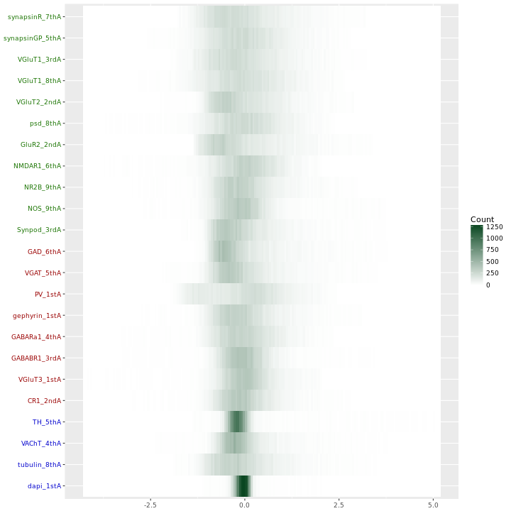
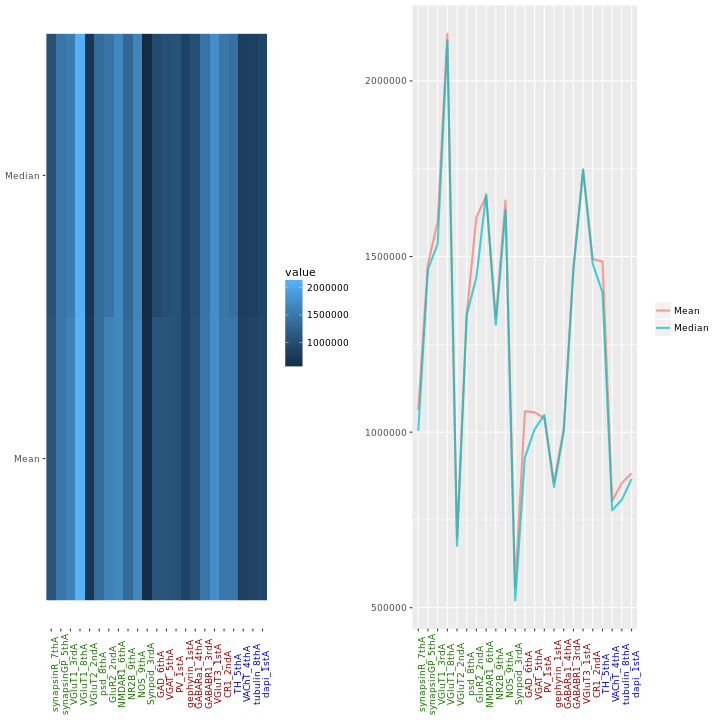
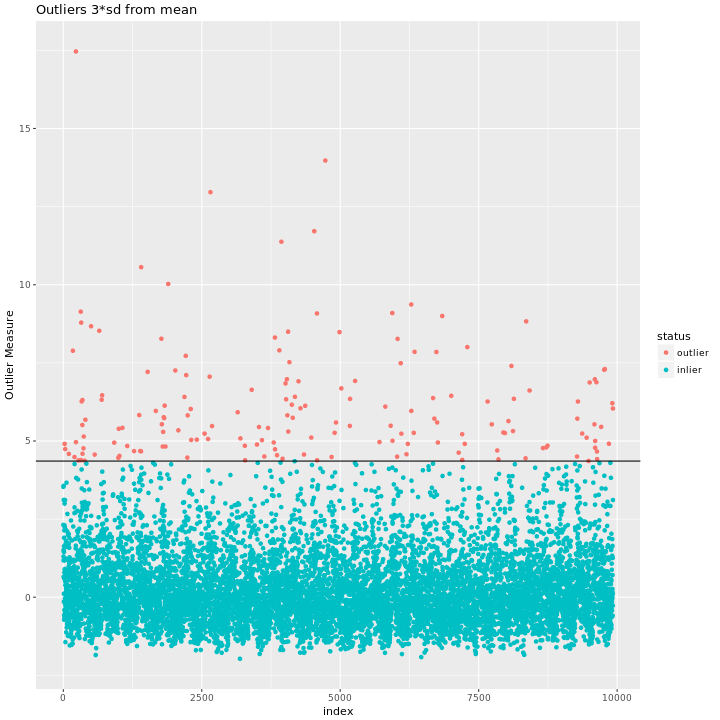
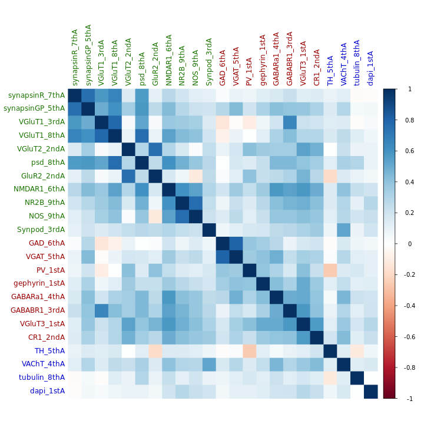
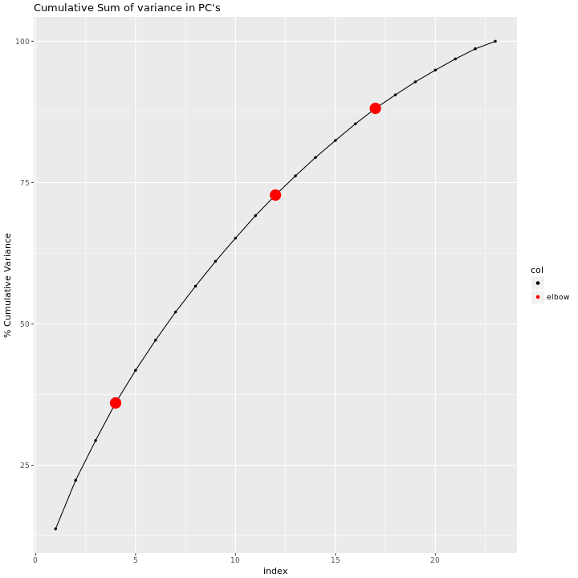
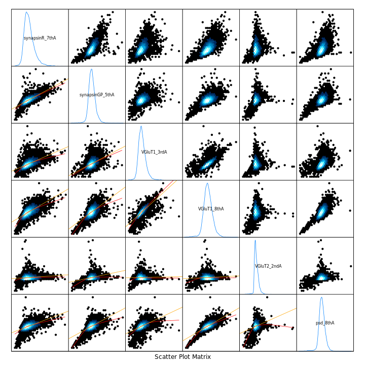
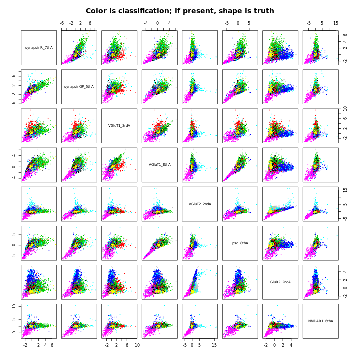
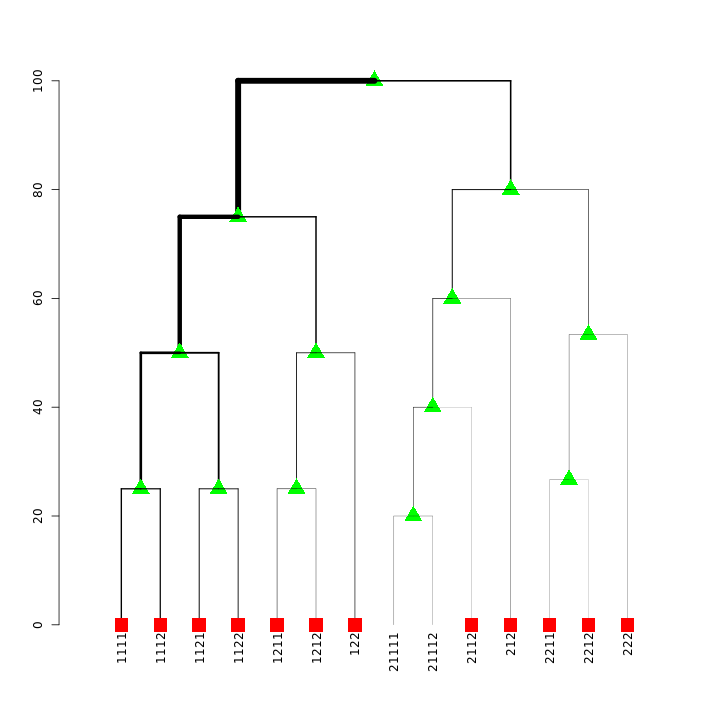
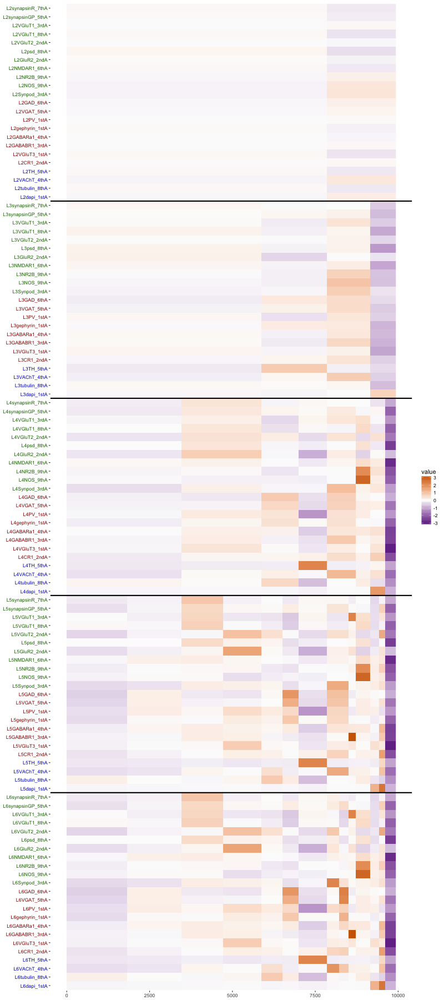
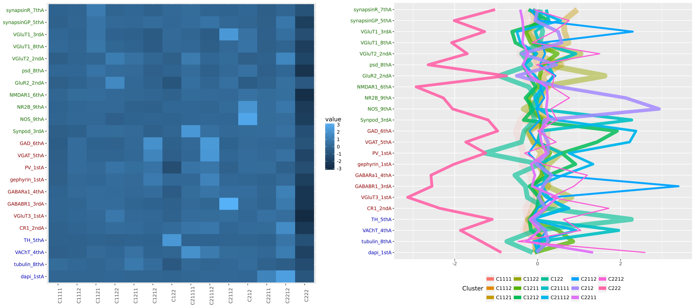

```{r knitOPTS, include=FALSE}
knitr::opts_chunk$set(cache = TRUE, dev = "png")
```

```{r render, eval=FALSE, echo=FALSE}
require(rmarkdown)
rm(list=ls()); 
rmarkdown::render("k15_201706.Rmd")
system("open k15_201706.html")
if(FALSE){
  system("cp k15_201706.html index.html")
  system("open index.html")
}
```

```{r setup,include=FALSE,results='asis',message=FALSE,warning=FALSE, echo = FALSE}
# Library calls here.
require(rmarkdown)
require(knitr)
suppressMessages(require(meda))
```

# 1-d Heatmap


# Location plots


# Outliers as given by randomForest


# Correlation Matrix


# Cumulative Variance with Elbows


# Paired Hex-binned plot


# Hierarchical GMM Classifications


# Hierarchical GMM Dendrogram


# Stacked Cluster Means plot
```{r stackM, include = FALSE, eval = FALSE}
suppressPackageStartupMessages(require(meda))
h <- readRDS("hmc.rds")
png("./plots/stackMM.png", height = 1800, width = 800)
plot(stackM(h, ccol = h$ccol, centered = TRUE)) 
dev.off()
```


# Cluster Means



--- 
---
